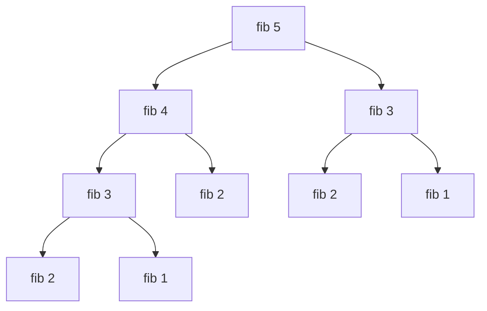
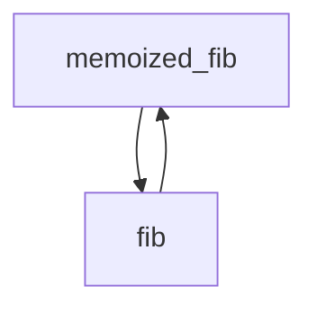

> If by chance I have omitted anything more or less proper or necessary, I beg
> forgiveness, since there is no one who is without fault and circumspect in all
> matters. 
> 
> Leonardo Pisano (1202)

The Fibonacci sequence in math has unmatched ubiquity and a very deep history. I
love generating these numbers! You can see them almost anywhere, and surprising
hidden connections exist with things such as the pascal's triangle and the
golden ratio. Here's a story about math and programming, with the Fibonacci
sequence as it's protagonist


## Haskell

Haskell is underrated. People say that it "changes the way you look at
problems", but what can Haskell offer that imperative language can't? Here's a
way to write the Fibonacci sequence in Haskell using the mathematical definition


### Recursion stole our lunch
```haskell
fib :: Integer -> Integer
fib 1 = 1
fib 2 = 1
fib n = fib (n-1) + fib (n-2)

```

now you can retrieve the Fibonacci numbers!

```haskell
ghci> fib 4
3
ghci> fib 6
8
ghci> fib 10
55

```

now let's actually stress-test this algorithm. 

```haskell
ghci> map fib [1..]
[1,1,2,3,5,8,13,21,34,55,89,144,233,377,610,987,1597,2584,4181,6765,10946,17711,28657,
46368,75025,121393,196418,317811,514229,832040,1346269,2178309,3524578,5702887,

```

it seems that it starts struggling when it generates $5702887$. It might be a big number, but
computers are bigger and there are algorithms which can generate us bigger
Fibonacci numbers. 

### More RAM?
Here's the reason why it's so slow. Notice that there are
multiple fib calls in different levels which will duplicate work and make the
algorithm much slower. One way we can speed this up is by caching the fib calls;
once we hit `fib 3` after the first time we shouldn't have to compute `fib 2 +
fib 1` every time, instead it should just know that it is equal to `2`. You
could use **memoization** to optimize this algorithm


### Memo(r)ization

So, how can we eliminate duplicate calls? One way is memoization

```haskell
memoized_fib :: Int -> Integer
memoized_fib  = (map fib [0..] !!)
  where fib 0 = 1
        fib 1 = 1
        fib n = memoized_fib (n-1) + memoized_fib (n-2)
```
Here, momoized_fib takes in an integer `n` and outputs the `n`th Fibonacci
number. It does it by taking the `n`th element of the array `map fib [0..]` with
`fib` defined in the `where` clause. 

The trick is to "piggyback" the recursive function `fib` to call copies of
`memoized_fib`. When the function is called, it will "default" to getting the
value of `fib` stored in the cache, but if it can't it will go to a recursive
step. This is a standard way in Haskell to memoize recursive functions

As an interesting note, the `memoized_fib` function is recursive but not because
it calls itself *directly*. It calls `fib`, which then calls `memoized_fib`,
which then calls `fib`, which then ...




The downsides are that it stores the Fibonacci number in an
array. What if we can eliminate a linear space requirement?

### A recursion with an old friend 
Recursion is a tool, so let's use it wisely. Here's a more clever implementation
of the algorithm. In the previous solution, we had to store all of the $n-1$ previous 
Fibonacci numbers to get the $n$'th number. But we only really need the last two
Fibonacci numbers to get the next one. 
```haskell
fib :: Integer -> Integer -> [Integer]
fib m n = next:(fib n next)
  where next = m + n
```

notice that it is *Blazingly Fast*
```haskell
ghci> fib 0 1
[1,2,3,5,8,13,21,34,55,89,144,233,377,610,987,1597,2584,4181,6765 ... 
17937362957614421485739794629281840208175624583257624165255681705328503542086633274122020296761574501458809301757594224667177036805013875010136580659797337792159160128372409395301179947004818874853960353968895662597604808775540855458
```

the numbers it generates when it is struggling come up to $232$ digits! Compare
that to the measly $7$ digits which we were getting with the recursive
implementation.  

### Magic of equational reasoning

Let's have the Fibonacci numbers written in a list:

$$ \begin{aligned}
\verb|fib| = 1, 1, 2, 3, 5, 8, 13  ... \\
\end{aligned}$$

we can take a copy of fib and keep the part without the first element using `tail`

$$ \begin{aligned}
\verb|fib|      &= 1, 1, 2, 3, 5, 8, 13  ...\\
\verb|tail fib| &= 1, 2, 3, 5, 8, 13, 21 ... \\
\end{aligned}$$

what if we add them together, vertically? This calls for `zipWith`

$$ \begin{aligned}
\verb|fib|      &= 1, 1, 2, 3, 5, 8, 13, ...\\
\verb|tail fib| &= 1, 2, 3, 5, 8, 13, 21,... \\
\hline \verb|zipWith (+) fib (tail fib)| &= 2, 3, 5, 8, 13, 21, 34, ...
\end{aligned}
$$

that looks a lot like where we started with! We just have to prepend a $1$ and,
in the spirit of DJ Khaled, another $1$


$$ \verb|1:1:zipWith (+) fib (tail fib)| = 1, 1, 2, 3, 5, 8, 13, 21, 34, ...  = \verb|fib|$$


> What if we ... write this last line in Haskell? 
{: .prompt-info }

```haskell
fib :: [Integer]
fib = 1:1:zipWith (+) fib (tail fib)
```

Will it compile? Will it work? Take your bets:

```haskell
ghci> fib
[1,1,2,3,5,8,13,21,34,55,89,144,233,377,610,987,1597,2584,4181, ...
```
It's also *Blazingly Fast!* Test it out yourself.

## Math
Enough programming. Let's do some math!

### Generating Functions

The best way to learn about this is through example. Let's pretend that we can
have an infinite polynomial whose coefficients are the Fibonacci sequence

$$y = \verb|fib| = 1 + 1 \cdot x + 2x^2 + 3x^3 + 5x^4 + \dots$$

let's do some *algebra*

$$xy = x \cdot \verb|fib| = x + 1x^2 + 2x^3 + 3x^4 + 5x^5\dots$$

stir the ingredients and let them get to know each other better...

$$ \begin{aligned}
y      &= 1 + x + 2x^2 + 3x^3 + 5x^4 + \dots\\
xy     &= \quad \ \ \  x + 1x^2 + 2x^2 + 3x^3 + \dots\\
\hline 
y + xy &= 1 + 2x + 3x^2 + 5x^3 + 8x^4 + \dots\\
\end{aligned}
$$

> That looks a lot like what we started with!
{: .prompt-info }

$$ y + xy = 1 + 2x + 3x^2 + 5x^3 + \dots = \frac{y - 1} {x} $$

Rearranging


$$ \begin {aligned}
y + xy        &= \frac {y-1} {x} \\ 
xy + x^2y - y &= -1 \\
\end{aligned} $$

$$ \boxed{y             = \frac {1} {1- x - x^2}} $$

From here, we can compute a closed form solution for the n'th Fibonacci 
number[^closed-form] using something called *partial fraction decomposition*. 

---
<details>
<summary> 
Show math
</summary>

$$y_k = \left(\frac{\sqrt 5 + 1}{2 \sqrt 5}\right)
\left(\frac{1 + \sqrt 5}{2}\right)^k + 
\left(\frac{\sqrt 5 - 1}{2 \sqrt 5}\right)
\left(\frac{1 - \sqrt 5}{2}\right)^k$$
</details>

---

In essence, the rational polynomial $(1 - x - x^2) ^{-1}$ contains all the
information of the Fibonacci sequence. We want a way to decode this information.
To do so, let's consider the father of all generating functions:

### The father of all generating functions: $\frac {1} {1-x}$

Let's go back to some high-school algebra. Difference of squares:

$$ a^2 - b^2 = (a - b) (a + b)$$

Lesser known are the generalizations of the difference of squares in higher
powers. I recommend you verify these with some pen and paper. These are:

$$ \begin {aligned}
a^3 - b^3 &= (a - b) (a^2 + ab + b^2) \\
a^4 - b^4 &= (a - b) (a^3 + a^2b + ab^2 + b^3) \\
a^5 - b^5 &= (a - b) (a^4 + a^3b + a^2b^2 + ab^3 + b^3)
\end{aligned}$$

If you stare at it long enough, you'll see a pattern. Set $a = 1$ and $b = x$ on
the last equation

$$ 1 - x^5 = (1 - x) (1 + x + x^2 + x^3 + x^4) $$

> Now, crank that exponent on the left hand side of the equation way up!
{: .prompt-tip }


$$ 1 - x^{300} = (1 - x) (1 + x + x^2 + \dots + x^{299} + x^{300}) $$

We're almost there. If our $x$ is within the range $-1 < x < 1$ then $x$ to
the power of a large power will effectively be zero

```console
bc > 0.99 ^ 300
.04

```

good, so now we can disregard that $x^{300}$ on the left hand side of the 
equation. So, as we crank the exponent to infinity, and as long as we restrict
the domain of $x$ to only lie within $1$ unit from zero, we have the equation


$$ 1 = (1 - x) (1 + x + x^2 + x^3 + x^4 \dots ) $$

from which we get

$$ \frac{1}{1-x} = 1 + x + x^2 + x^3 + x^4 \dots $$

> Bad things happen when you plug in values for $x$ which are outside this
> range! Try plugging in $x=2$:
> $$ \frac{1}{1-2} = -1 = 1 + 2 + 4 + 8 \dots$$
{: .prompt-danger }

### Composition of generating functions

Notice that

$$ 
\begin{aligned}y = \frac {1} {1- x - x^2} &= \frac{1}{1 - (x+x^2)}  \\
&= 1 + (x+x^2) + (x+x^2)^2 + (x+x^2)^3 + \dots
\end{aligned}$$

Let's try to compute the Fibonacci sequence directly from this definition. 
If we can find a way to add and multiply generating functions, we can
generate Fibonacci sequences!


### ... all the way back to Haskell

I wanted a Haskell object that could add, multiply, and divide generating
functions. I wanted it to be as general as possible so that maybe in the future
I can put in complex numbers. so I chose to use the `Num` typeclass

```haskell
data Gen a = Gen [a] deriving (Show, Eq)

instance (Num a, Eq a) => Num (Gen a) where
  -- TODO
  Gen a + Gen b = 
```

Notice I didn't do below, where I defined `a` to be of the `Num` typeclass. 
```haskell
data (Num a) => Gen a = Gen [a] deriving (Show, Eq)
-- ...
```

It's better to be as general as possible with your data declarations and then making
instance of that data for a certain typeclass, than to restrict the data type
right off the bat. What if we want to extend generating functions to more exotic
objects, like matrices and vectors?

Now on to add a **sum** function
```haskell
instance (Num a, Eq a) => Num (Gen a) where
  Gen a + Gen b = Gen (sum_ a b)
                 where sum_ (a:as) (b:bs) = (a + b) : sum_ as bs
                       sum_ [] bs = bs
                       sum_ as [] = as
```

The product function needed a little mathematical spice. We need something
called a *convolution*. 

To understand convolutions, simply take two polynomials and multiply them. The
act of calculating the coefficient of a term is called a convolution.

---
<details>
<summary> 
Show math
</summary>

$$

$$
</details>

---

## Footnote
[^closed-form]:  <https://math.stackexchange.com/questions/3899926/generating-functions-and-a-closed-form-for-the-Fibonacci-sequence-the-big-pict>
