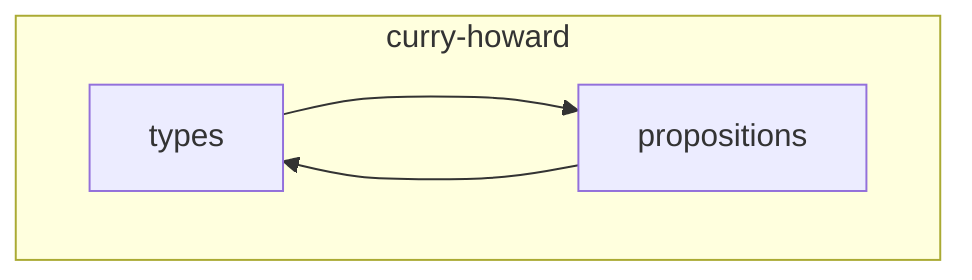
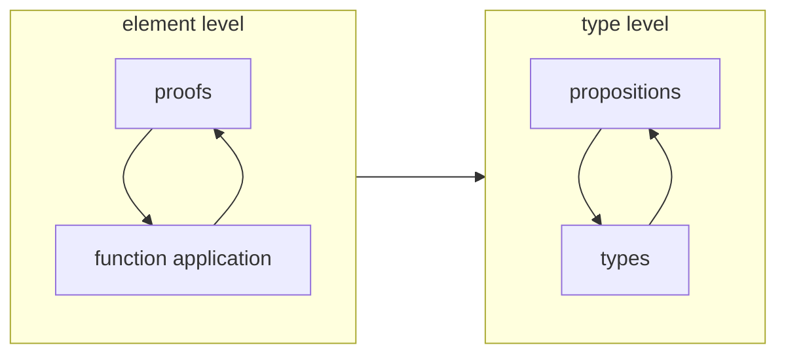
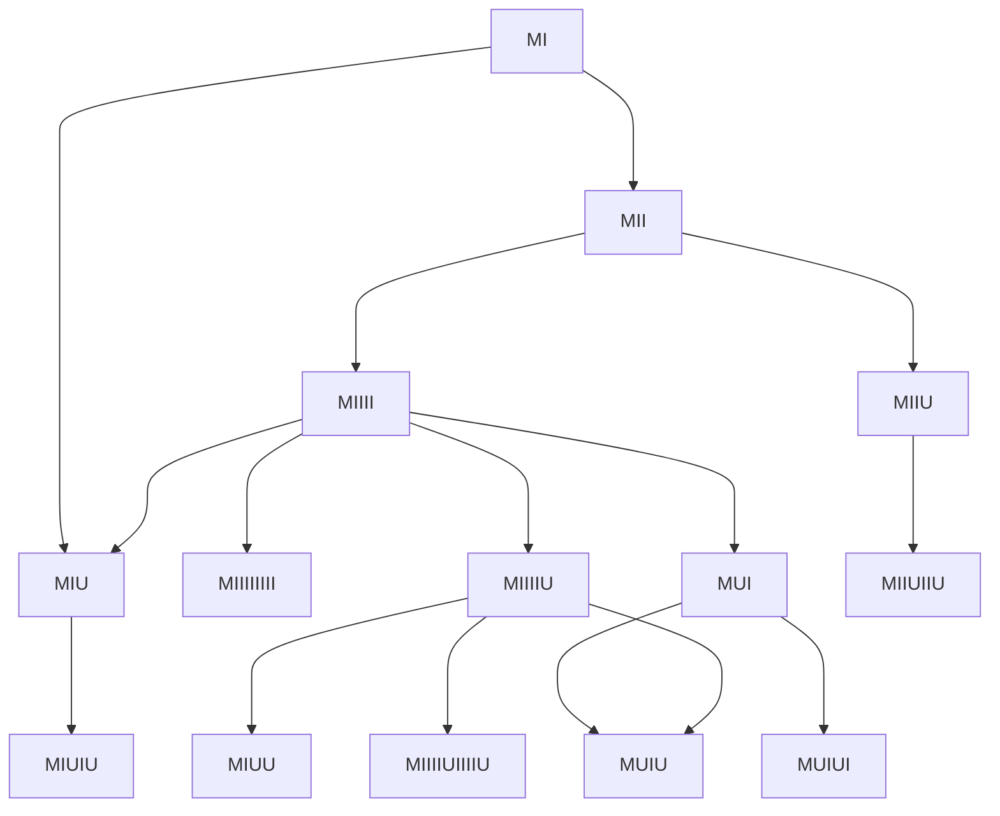

> God, inspired by the barber paradox, wanted to erase the existence of
> turtles by plotting a paradox. "Turtles cannot exist!" he said, "because who then
> shaves the barber turtle's head?" All the turtles synchronously blinked once,
> and moved on with their lives. The omniscient god saw his mistake at once;
> turtles don't have hair.

I've recently delved into a deep dive into exploring the Curry - Howard - Lambek 
isomorphism and I want to share my insights. I have played around with the [Lean
theorem prover](https://leanprover.github.io/) for a bit and enjoyed formally proving mathematical
theorems in Lean. Theorem proving using formal verifiers can be very fun! But I had
this nagging feeling of not knowing what is going on under the hood. This
article is an attempt to fix that so we can explore what it
takes to build a theorem prover from the ground up

This article is about using the Curry - Howard 
isomorphism to build a proof verifier leveraging Haskell's type system from
scratch. I want to use as few language extensions as possible, only opting for
it if it increases convenience and if it is truly necessary. The ultimate goal
is to build Peano arithmetic into Haskell's type system and to generate proofs 
about arithmetic. The goal of this article is to explore first-order logic.
Along the way, we'll get to see cool turtles.

## The Isomorphism

> Let it be said at once that there is no unanimity on the subject. This is a
> healthy situation, for each point of view suggests problems and methods
> which the others do not.
>
> Haskell Curry, *Foundations of Mathematical Logic*

### Types and Functions

Let's consider 3 types. 

The first one is the `Void` type. No object in the world
has this type, making it awkward (also impossible) to reference and/or produce an object of this
type. 

The other type is `()`. Only one object in the world can ever have the
type, namely `()`. 

The last is type `Bool`. Only two objects, named `True` and `False`,
can have the type `Bool`.

 
_a one-to-one correspondence between turtles and sets_
The next thing to consider is functions. How many can there be from one type to
another? Let's start with functions with type `Bool` as the argument. Here are
some examples:

```haskell
not :: Bool -> Bool 
not True = False
not False = True

cons :: Bool -> ()
cons _ = ()

```

How can we have a function which accepts a `Void` and returns `Bool`? There are
no objects with type `Void`. In the requirement for a function, every object
in the domain there is a unique mapping to an object in the range / codomain.
But what if there is no domain? In Haskell, the `absurd` (defined in
`Data.Void`) has the type signature

```haskell
`{-# LANGUAGE ExplicitForAll #-}`
absurd :: forall a. Void -> a
```

in other words, for any type `a`, there is one and only one function from `Void`
to `a`, namely `absurd`. 


| Function Type Signature | Number of functions | Functions                              |
|:------------------------|:--------------------|:---------------------------------------|
| `Void -> Void`          | 1                   | `id`                                   |
| `forall a. a -> Void`   | 0                   | None                                   |
| `forall a. Void -> a`   | 1                   | `absurd`                               |
| `Bool -> ()`            | 1                   | `_ -> ()`                              |
| `() -> ()`              | 1                   | `id`                                   |
| `() -> Bool`            | 2                   | `() -> True`, `() -> False`            |
| `Bool -> Bool`          | 4                   | `not`, `_ -> True`, `_ -> False`, `id` |
|                         |                     |                                        |

With some time to consider, you'll see that for sets $A, B$ with $m, n$ elements
respectively, the number of functions from `A` to `B` is 

$$n^m$$ 

This is one of the reasons why functions are elements of what is called an
exponential type. It is common in mathematics to denote the set of functions 
$A \rightarrow B$ by $B ^ A$. In this sense, functions in Haskell have their own type

### Sum types and Product types

How can we combine types? The product type is also known as the tuple type in
Haskell and is defined by two functions, `fst` and `snd`, which returns the left or right
object in the tuple

<!-- https://q.uiver.app/#q=WzAsMyxbMSwwLCIoYSwgYikiXSxbMCwxLCJhIl0sWzIsMSwiYiJdLFswLDEsIlxcdGV4dHtmc3R9IChhLCBiKSIsMl0sWzAsMiwiXFx0ZXh0e3NuZH0gKGEsYikiXV0= -->
<iframe class="quiver-embed" src="https://q.uiver.app/#q=WzAsMyxbMSwwLCIoYSwgYikiXSxbMCwxLCJhIl0sWzIsMSwiYiJdLFswLDEsIlxcdGV4dHtmc3R9IChhLCBiKSIsMl0sWzAsMiwiXFx0ZXh0e3NuZH0gKGEsYikiXV0=&embed" width="437" height="304" style="border-radius: 8px; border: none;"></iframe>
On the other hand, an example of a sum type is Haskell's `Either` type
<!-- https://q.uiver.app/#q=WzAsMyxbMSwwLCJcXHRleHQge0VpdGhlciBhIGJ9Il0sWzIsMSwiXFx0ZXh0e2J9Il0sWzAsMSwiXFx0ZXh0e2F9Il0sWzEsMCwiXFx0ZXh0e1JpZ2h0IGJ9IiwyXSxbMiwwLCJcXHRleHR7TGVmdCBhfSJdXQ== -->
<iframe class="quiver-embed" src="https://q.uiver.app/#q=WzAsMyxbMSwwLCJcXHRleHQge0VpdGhlciBhIGJ9Il0sWzIsMSwiXFx0ZXh0e2J9Il0sWzAsMSwiXFx0ZXh0e2F9Il0sWzEsMCwiXFx0ZXh0e1JpZ2h0IGJ9IiwyXSxbMiwwLCJcXHRleHR7TGVmdCBhfSJdXQ==&embed" width="503" height="304" style="border-radius: 8px; border: none;"></iframe>


The `Either` type is used to represent types that may come from the `Left` type
or the `Right` type. The `Maybe` type is also a special case of an `Either`
type. As an example, division with floats yield a `Maybe Float` because division
by zero yields a `Nothing`

```haskell
(/:) :: Float -> Float -> Maybe Float
a /: 0 = Nothing
a /: b = Just (a / b)
```

Using product, sum and exponential types, we can create a diverse array of types
and interpret its structure using the other side of the isomorphism

### The other side of the isomorphism

That's it for `types`. How does this relate to `propositions`?



Curry - Howard - Lambek noticed the similarity between the type system we
created above to the mechanisms of classical logic. To start with the
isomorphism, we will say that `()` is `True` and `Void` is `False`

```haskell
type False = Void
type True = ()
```

A proposition `P` is mapped to a type in our system. Here's the important bit

> `P` is true if it's corresponding type is non-empty, and it is false if its
> corresponding type is empty. 
{: .prompt-tip }


Here is a table of the corresponence 

| Types                      | Propositions |
|:---------------------------|:-------------|
| `Void`                     | False        |
| `()`                       | True         |
| `(a, b)`                   | a and b      |
| `Either a b`               | a or b       |
| Exponential type: `a -> b` | a implies b  |


```haskell

-- Proposition land -> Type land
type (:|) = Either 
type (:&) = (,)
-- We use Haskell's default `->` to denote implication
```


There is another way to denote a false proposition. Remember from the table in
the previous section that for any type `a` there are zero functions of type `a -> Void`.

| Function Type Signature | Number of functions | Functions |
|:------------------------|:--------------------|:----------|
| `Void -> Void`        | 1                   | `id`      |
| `forall a. a -> Void`   | 0                   | None      |
| ...                     | ...                 | ...       |

So, what if we are able to construct a function of type `a -> Void`? That would be
impossible, *unless* `a` itself was `Void`! That means that the existence of a
function of type `a -> Void` means `a` is uninhabited. 

This way, we can define that a proposition `P` is false if there is a function
of type `P -> Void`


```haskell
type Not a = a -> False
```

Putting it all together, here is our logical universe so far:

```haskell
-- Type operators allow types which are also infix operators
{-# LANGUAGE TypeOperators #-}
type False = Void
type True = ()
type Not a = a -> False
type (:|) = Either 

-- makes (:&) a product type
data a :& b= a :& b deriving Show
left :: (a :& b) -> a
left (a :& b) = a

right :: (a :& b) -> b
right (a :& b) = b

-- We use Haskell's default `->` to denote implication

-- Type variables
type P = ()
type Q = ()
type R = ()

```

Let's mess around a little bit

```haskell
ghci> a = () :& () :: P :& Q

ghci> :t a
a :: P :& Q

ghci> :t left 
left :: (a :& b) -> a

ghci> :t left a
left a :: P

ghci> :t right a
right a :: Q

ghci> b = Left () :: P :| R

ghci> :t b
b :: P :| R

```

### *Mise en place*

We now have all out ingredients out in the table. Let's stop here and have some
fun. Despite our simplistic setup (7 type synonyms, a data declaration, and 2 functions) 
we have at our fingertips the entirety of constructive logic. Let's prove a theorem.

--- 
A senator in the USA must be 30 years old. Let us denote 

`P = being a senator in the united states`

`Q = being at least 30 years old`.

Therefore, the implication `P -> Q` is true, so its type is inhabited.

`Not Q` is equivalent to `being younger than 30 years old`. What can we
deduce? If someone is younger than 30 years old, it's impossible for them to
be a senator. In other words, `Not Q -> Not P`. Putting it all together,
 we have that `P -> Q` implies `Not Q -> Not P`, or that a function
 
 ```haskell
 contrapositive :: (p -> q) -> (Not q -> Not p)
 ```

exists with this certain type, where `p` and `q` are arbitrary types

---

This is another level to our isomorphism. If propositions are types, that
means proofs of propositions are functions between types!



How can we construct this type? `contrapositive` takes in a function and returns
another function. We can simplify the type signature by noticing that `Not q` is
actually `q -> False` in disguise. Unfolding our definition of `Not`, we get that
`contrapositive` should have a type signature of 

 ```haskell
contrapositive :: (p -> q) -> ((q -> False) -> ( p -> False))
 ```

> `(->)` is not associative but actually right associative, which means that
> 
> `a -> b -> c` is evaluated as `(a -> (b -> c))` which is not equal to `((a ->
> b) -> c)`
{: .prompt-warning }

because of the right - associativity of `->`, our type signature simplifies to
 ```haskell
contrapositive :: (p -> q) -> (q -> False) ->  p -> False
 ```

so our `contrapositive` function takes in three arguments: 
1. `pq :: p -> q`
2. `nq :: q -> False`
3. `p :: p`

Our goal is to produce a `False`. Stop here for a couple minutes and try to
figure out how to return a `False` from these 3 functions. Or, you could just
admire these turtles for a little bit

 
_above there are propositions, below there are types_


Welcome Back

Here's one way we can implement this. We first apply modus ponens to `p` and
`pq`, and apply the result of that computation to `nq`

```haskell
contrapositive :: (p -> q) -> (q -> False) ->  p -> False
contrapositive pq nq p  = nq . pq $ p
```

or more succinctly, using currying and using the `Not` type synonym

```haskell
contrapositive :: (p -> q) -> (Not q -> Not p)
contrapositive pq nq  = nq . pq
```

We have now proved our first theorem in Haskell! It compiles!
That's one of the features of type-level programming. In
regular programming, we are not sure if our program is correct even if the
compiler accepts our program. In type level programming, we rejoice when the
compiler accepts our offering


> Try proving the converse of this! (Don't spend too long, though.)
>
> `convcontra :: (Not q -> Not p) -> p -> q`
{: .prompt-tip }


## Constructive logic

 
_constructive logic_

Let's speedrun constructive logic with me! I will offer some function type
signatures, and our goal is to "prove" the proposition by constructing a
function with this type. Let's start with `cases`

### Cases

> "But one false statement was made by Barrymore at the inquest. He said that there were no traces upon the ground round the body. He did not observe any. But I did—some little distance off, but fresh and clear."
> 
> "Footprints?"
> 
> "Footprints."
> 
> "A man's or a woman's?"
> 
> Dr. Mortimer looked strangely at us for an instant, and his voice sank almost to a whisper as he answered:
> 
> "Mr. Holmes, they were the footprints of a gigantic hound!"
> 
> Conan Doyle, *The Hounds of Baskerville*

Sherlock Holmes arrives at the body of a murder victim. He deduces from the
footprints that the perpetrator must be a man's or a woman's. Because of
Sherlock Holmes' impeccable deductive skills, he concludes, because of the
type of the wound on the neck of the deceased, that if the perpetrator was a man,
he must have used a knife. If the perpetrator was a woman, then due to the
delicate nature and angle of the wound, he deduced that the instrument of murder
must have also been a knife.

Sherlock Holmes, adept in "deduction" but ignorant in mathematical logic,
neglected to see that the murder weapon was a knife. 


Here's how we formalize this. 

$$
\begin{aligned}
a\ |\ b \\
a \implies c \\
b \implies c \\
\hline
c
\end {aligned}
$$

```haskell
-- also known as `or elimination`
cases :: (a :| b) -> (a -> c) -> (b -> c) -> c
cases (Left a) (ac) _  = ac a
cases (Right b) _ (bc) = bc b
```

As a corollary, we can prove this logical theorem:

$$\text{Not } a\ \& \text{Not } b \to \text{Not } a\ |\ b$$

```haskell
notandnot :: Not a :& Not b -> Not (a :| b)
notandnot (na :& nb) aorb = cases aorb
                            (\a -> absurd $ na a)
                            (\b -> absurd $ nb b)
```

> Try proving the converse of this!
>
> `notor :: Not (a :| b) -> Not a :& Not b`
{: .prompt-tip }

Our logical universe is starting to look more cozy with all these theorems we're creating.

### Or introduction

Sherlock, after a course in first-order logic, has arrived at the conclusion
that the murder weapon was a knife. Inspired by his new knowledge of logic, he
concluded that the murder weapon was either a knife or a gun. He thought about
it for a second and realized that, although logically true, it was a logical
dead end.

Here's the logic written down mathematically:


$$
\begin{aligned}
a\\
\hline
a \text{  or  }  b
\end {aligned}
$$

This is leveraging the fact that `or` in mathematics is an inclusive or. Both
sides of `or` can be true.

```haskell
-- left or introduction
lorintro :: a -> a :| b
lorintro a = Left a
```


### A quickie

Here's a quick proof of this logic theorem:

$$ b\ | \text{ Not } a \to (a \to b) $$

```haskell
notaorb :: Not a :| b -> a -> b
notaorb (Left na) a = absurd $ na a
notaorb (Right b) _ = b
```

Note the `absurd`. This is to prove the hypothesis when there is a 
contradiction (in this case, we had both `a` and `Not a`). The `absurd :: Void
-> a` function
is the computer code translation of the Latin phrase "ex falso quodlibet" (from
falsehood, anything) 

Note that the converse, 

$$ (a \to b) \to b\ | \text{ Not } a $$

```haskell
convnotaorb :: (a -> b) -> Not a :| b 
```

is not derivable in constructive logic. We will need more axioms. More on that later.

### The third side of the isomorphism

There are two sides to every isomorphism. But the best isomorphisms have three
sides. 

<!-- https://q.uiver.app/#q=WzAsMyxbMiwwLCJcXHRleHR7cHJvcG9zaXRpb25zfSJdLFswLDIsIlxcdGV4dHt0eXBlc30iXSxbNCwyLCJcXHRleHR7YWxnZWJyYX0iXSxbMCwyLCIiLDAseyJzdHlsZSI6eyJ0YWlsIjp7Im5hbWUiOiJhcnJvd2hlYWQifX19XSxbMiwxLCIiLDAseyJzdHlsZSI6eyJ0YWlsIjp7Im5hbWUiOiJhcnJvd2hlYWQifX19XSxbMSwwLCIiLDAseyJzdHlsZSI6eyJ0YWlsIjp7Im5hbWUiOiJhcnJvd2hlYWQifX19XV0= -->
<iframe class="quiver-embed" src="https://q.uiver.app/#q=WzAsMyxbMiwwLCJcXHRleHR7cHJvcG9zaXRpb25zfSJdLFswLDIsIlxcdGV4dHt0eXBlc30iXSxbNCwyLCJcXHRleHR7YWxnZWJyYX0iXSxbMCwyLCIiLDAseyJzdHlsZSI6eyJ0YWlsIjp7Im5hbWUiOiJhcnJvd2hlYWQifX19XSxbMiwxLCIiLDAseyJzdHlsZSI6eyJ0YWlsIjp7Im5hbWUiOiJhcnJvd2hlYWQifX19XSxbMSwwLCIiLDAseyJzdHlsZSI6eyJ0YWlsIjp7Im5hbWUiOiJhcnJvd2hlYWQifX19XV0=&embed" width="836" height="432" style="border-radius: 8px; border: none;"></iframe>

The third side is algebra. We called our three type operators sum, product, and
exponential. Could they possibly correspond to the sum, product, and exponential
we are used to in algebra?

| Types                      | Propositions | Algebra     |
|:---------------------------|:-------------|:------------|
| `Void`                     | False        | $0$         |
| `()`                       | True         | $1$         |
| `(a, b)`                   | a and b      | $a \cdot b$ |
| `Either a b`               | a or b       | $a + b$     |
| Exponential type: `a -> b` | a implies b  | $b ^ a$     |


Let's test it out. We know from algebra that

$$a \cdot (b + c) = a \cdot b + a \cdot c$$

putting in the language of propositions:


$$a\ \&\ (b\ |\ c) = (a\ \&\ b)\ |\ (a\ \&\ c)$$

translating it into proposition land in Haskell, we have

```haskell
--         and  or
andor :: a :&(b :| c) -> (a :& b ) :| (a :& c)
```

is true. This is only one side of the implication; we have to consider the other
side.


```haskell
--             and    or    and
andorand :: (a :& b ) :| (a :& c) -> a :& (b :| c)
```
 
Here are the proofs:

```haskell
andor :: a :&(b :| c) -> (a :& b ) :| (a :& c)
andor (a :& (Left b))  = Left (a :& b)
andor (a :& (Right c)) = Right (a :& c)


andorand :: (a :& b ) :| (a :& c) -> a :& (b :| c)
andorand (Left  (a :& b)) = a :& Left b
andorand (Right (a :& c)) = a :& Right c
```

Hold on. Here's another theorem in logic:

$$a\ |\ (b\ \&\ c) = (a\ |\ b)\ \&\ (a\ |\ c)$$

which, using the isomorphism, translates in algebra to 

$$a + b \cdot c = (a + b) \cdot (a + c)$$

That is not true in regular algebra! How can we explain this? Well, since `a`, `b`, and `c`
are ultimately propositions, they are booleans and follow boolean arithmetic:


| $a$ | $b$ | $a + b$ | $a \cdot b$ |
|-----|-----|---------|-------------|
| 0   | 0   | 0       | 0           |
| 0   | 1   | 1       | 0           |
| 1   | 0   | 1       | 0           |
| 1   | 1   | 1       | 1           |

$$\begin{aligned}
(a + b) \cdot (a + c) &= a \cdot a + a\cdot c + b \cdot a + b \cdot c &
\text{distributive property}\\
                      &= a \cdot 1 + a\cdot c + b \cdot a + b \cdot c & \quad a \cdot
                      a = a = a \cdot 1 \\ 
                      &= a \cdot (1 +  c + b)  + b \cdot c & \quad 1 + x = 1\\
                      &= a + b \cdot c
\end{aligned}$$

Here is the proof of both sides

```haskell
--         or    and
orand :: a :| (b :& c) -> (a :| b) :& (a :| c)
orand (Left a) = Left a :& Left a
orand (Right (b :& c)) = Right b :& Right c

--            or    and   or
orandor :: (a :| b) :& (a :| c) -> a :| (b :& c)
orandor (Left a :& _)        = Left a
orandor (_ :& Left a)        = Left a
orandor (Right b :& Right c) = Right (b :& c)
```


### Exponential types

This isomorphism in algebra is more profound when considering exponential types.
Let's translate this:

$$a ^ {b + c} = a^b \cdot a ^ c$$

into the language of propositions:

$$(( b\ |\ c ) \to a) \to ((b \to a)\ \&\ (c \to a))$$

and its converse: 

$$((b \to a)\ \&\ (c \to a)) \to ((b\ |\ c) \to a)$$

Here's the proofs. I expect that you're proving these with me, unless you
masochistically consume my Haskell code recreationally. The hardest part with
proving things is naming them.

```haskell
borctoa :: (b :| c -> a) -> (b -> a) :& (c -> a)
borctoa f = (\b -> f (Left b)) :& (\c -> f (Right c))

convborctoa :: (b -> a) :& (c -> a) -> b :| c -> a
convborctoa (f :& _) (Left b) = f b
convborctoa (_ :& g) (Right c) = g c
```

as a corollary, we can prove this theorem easily:

$$\text{Not } (a\ |\ b) \to \text{Not } a\ \&\ \text{Not } b  $$

```haskell
notor :: Not (a :| b) -> Not a :& Not b
notor nab = borctoa nab
```

> Try proving a similar proposition: 
> 
> `notand :: Not (a :& b) -> Not a :| Not b`
{: .prompt-tip }

## The MU Puzzle 

> God was horrified by the immense diversity brewing in the world, so he struck
> it all down and replaced existence with 3 letters: `M`, `I` and `U`. The
> turtles were unhappy about their inexistence, but decided to hang in there.


After the explosion of many `MIUMUMUIMIUMUIMUMIUIUUIUI...` and a second parallel
universe that started on `IUMUMIMUMIMIMUMIMUMIMIMNUMUUUUUU`, God was annoyed at
the chaos and the cacophony of `M, I, U`. He wanted some more rules


_turtles enjoying their time not existing_

### Rules which God imposed

1. If the last letter is `I`, you may add `U`
2. Suppose you have an `Mx`, then you may obtain `Mxx`
   - for example, `MIUM` can turn into `MIUMIUM` if you choose
3. You may replace `III` with a `U`
   - for example, `MIIIUIM` can turn into `MUUIM` 
4. If `UU` occurs within your string, you can drop it.

The first string out of existence was an `MI`

That's all of it. These rules were actually imposed by God which is Douglas
Hofstadter in his classic book **Gödel, Escher, Bach**. The object of the MU
puzzle is to derive an `MU` from the starting string and the rules. Try it out

### Forest and the Trees

 
_time has passed trying to solve the MU puzzle_

Here's some code to generate MIU strings in Haskell. I use Mermaid to generate
these graphs and I set Haskell up to output in that format. Pardon my unpolished
code; I never said I was a programmer.

```haskell
import Data.List (nub)

data MIU = M | I | U deriving (Eq, Show)
type ValidString  = [MIU]
type Universe = [ValidString]

showValid :: Show a => [a] -> String
showValid  = concat . (map show)

nextGen :: ValidString -> Universe
nextGen xs = nub $ reiterate xs : nextGen_ [] xs where
                                  nextGen_ xs y@(I:I:I:ys) = (rxs ++ U:ys) : (rxs ++ y) :
                                                          nextGen_ (U : xs) (ys) ++ nextGen_ (I : xs) (I:I:ys)
                                                          where rxs = reverse xs
                                  nextGen_ xs y@(U:U:ys) = (rxs ++ ys) : (rxs ++ y) :
                                                          nextGen_ (U : xs) (U:ys) ++ nextGen_ xs ys
                                                          where rxs = reverse xs
                                  nextGen_ xs (y:ys) = nextGen_ (y:xs) (ys)
                                  nextGen_ (I:xs) [] = [reverse (U:I:xs)]
                                  nextGen_ _ [] = []

updateGen :: Universe -> Universe
updateGen xs = nub . concat $ map nextGen xs

reiterate :: ValidString -> ValidString
reiterate (M:xs) = M:(xs ++ xs)

printNext valid = mapM_ (\x -> putStrLn (showValid valid ++ " ---> " ++ x))
                        (map showValid ((reiterate valid) : nextGen valid ))
```

Here's a selected output of the generations:



There are two modes of thinking. The first mode is the **Mechanical** mode. This
is the mode you are in when you are applying rules without question. Think 
high school algebra exams where you are supposed to recite the difference of
squares or the quadratic equation, or following stoplights and street signs, or
making new MIU strings. 

The second mode is the **Intelligent** mode. This is when you go one level above
and let room for thoughts *about* the mechanical mode. Think about the time you
feel frustrated about math rules or about legislation. After spending some time in the
mechanical mode of churning MIU strings, you can catch yourself turn into the
Intelligent mode. Here, you ask yourself all kinds of questions about MIU
strings and see all kinds of patterns. Notice, for instance, that all strings
start with an `M`. God did not impose it so. It merely turned out that way through his
divine rules and because we have a mind which can go into Intelligent mode and
form patterns.

> The difference, then, is that it is *possible* for a machine to act
> unobservant; it is impossible for a human to act unobservant
>
> Douglas Hofstadter, *GEB*

So, after minutes or hours of tackling the MU puzzle, why is it that we cannot
get the string `MU` from these set of rules?

### Solution to the MU Puzzle

Notice the 3rd rule of the MU puzzle:

> 3 . You may replace `III` with a `U`

In a way, this suggests that a `U` contains three `I`s. 

| Letter | Value |
|:-------|:------|
| `M`    | 0     |
| `I`    | 1     |
| `U`    | 3     |

So, we can assign numeric values to MIU strings. Each rule will change the value
of a string in a predictable amount

| Rule                                                | Change in value |
|:----------------------------------------------------|:----------------|
| If the last letter is `I`, you may add `U`          | $+3$            |
| Suppose you have an `Mx`, then you may obtain `Mxx` | $\times 2$      |
| You may replace `III` with a `U`                    | 0               |
| If `UU` occurs within your string, you can drop it. | $-6$            |

The question of getting `MU` then boils down to the question of getting a string
of value $3$. If we start from 1, and we can double, add 3 or subtract 6, is it
possible to get a 3?

We started with an `MI`. This has a value of $1$. By repeatedly applying the
doubling rule, we can obtain strings of value $2^n = 1, 2, 4, 8 ...$ 

By applying the "add `U`" rule, we can increase the value of our string by 3.
This allows us to have string values of the form 

$$2^x + 3\cdot y$$

Finally, by applying the "drop `UU`" rule, we can decrease the value of our string by 6.
This allows us to have string values of the form 

$$2^x + 3\cdot y - 6 \cdot z$$

where `x` is how much we have doubled, and `y, z` are messy constants.

Note that any of the numbers of this form is not divisible by $3$. This is
because $3$ and $6$ are divisible by $3$, but $2^x$ is not. 
Therefore, it is impossible to form an `MU`from `MI` with these rules, because
any string we form cannot have a value of $3$.

## Deconstructive Logic

 

We have discussed constructive logic. Although constructive logic is powerful in
it's own, it fails to prove converses of theorems which we proved earlier.
Namely, these theorems:

```haskell
-- CONVERSE OF: notaorb :: Not a :| b -> a -> b
convnotaorb :: (a -> b) -> Not a :| b 
```

and

 ```haskell
-- CONVERSE OF: contrapositive :: (p -> q) -> (Not q -> Not p)
convcontra :: (Not q -> Not p) -> (p -> q)
 ```
 
 finally,
 
 ```haskell
notand :: Not (a :& b) -> Not a :| Not b
 ```

The moral lesson of the MU puzzle is that no formal system is every perfect.
Indeed, because of Godel's first incompleteness theorem, any system capable of
proving all truths about the natural numbers is bound to be inconsistent, i.e.
there will be a`P` where `P` and `Not P`  are proved within the same
system. Therefore, in logic, we want to have a strong a system as possible to be
able to prove as many theorems as we wish, but not too strong so that inconsistencies pop up.


Like trying to derive `MU`, you can try to prove these with the current tools
you have, but find that it is impossible to do. We need to strengthen our system
by adding one more theorem

### What more is needed?

Let's consider a mathematical question. 

---
Can there be two irrational numbers $m,
n$ where $m^n$ is rational? Think about it for a minute.

<details><summary>Solution</summary>
Consider $\sqrt{2}$. We know that $\sqrt{2}$ is irrational, so $n = \sqrt{2} ^
\sqrt{2}$ is either rational or irrational. 

<br/>
If $n$ is rational, we have satisfied the conclusion

<br/>
If $n$ is irrational, then 

$$n ^ \sqrt{2} = \sqrt{2} ^ {\sqrt{2} \sqrt 2} = \sqrt{2} ^ 2 = 2$$ 

which is rational
<br/>

Note that, in this proof, we are uncertain whether $n = \sqrt 2 ^ \sqrt 2$ is
rational or not, but it is fine because both ways allow us to satisfy the
conclusion of our problem. It is known, using theory, that $n$ is irrational, but
that is not needed in this proof
</details>
---


The proof of the solution to this question is called a *non-constructive* proof.
This although we deduced that there are two irrational numbers such that $m^n$
is rational, we didn't pin down which numbers those were. We just deduced that
it must exist. Some mathematicians and philosophers have qualms about the nature
of non constructive proofs. In general, however, to produce a non constructive
proof, we need to exclude the middle. 

### No more grey

Black and white. Yin and yang. These concepts encapsulate the next level up from
constructive logic: **Classical Logic**. To allow our system to prove theorems
in classical logic, we need the **Rule of Excluded Middle**

$$\forall P:\ P\ |\ \text{Not } P$$

```haskell
-- unsafeCoerce :: a -> b
import Unsafe.Coerce (unsafeCoerce)

excl :: a :| Not a
excl = unsafeCoerce ()
```

We needed `unsafeCoerce` to bypass the type checker create this new axiom into 
existence. Now, we are able to prove the theorems above:

```haskell
-- CONVERSE OF: notaorb :: Not a :| b -> a -> b
convnotaorb :: (a -> b) -> Not a :| b
convnotaorb fab = cases excl -- a or not a
                    (\a  -> Right $ fab a)
                    (\na -> Left na)
```

We can now also prove that 

$$\text{Not Not } a = a$$ 

and from there we can prove `convcontra :: (Not q -> Not p) -> (p -> q)`
```haskell
-- also known as proof by contradiction
fromnotnot :: Not (Not a) -> a
fromnotnot nna = cases excl
                    (\a -> a)
                    (\na -> absurd (nna na))
                    
-- a -> ((a -> False) -> False)
tonotnot :: a -> Not (Not a)
tonotnot a na = na a

-- CONVERSE OF: contrapositive :: (p -> q) -> (Not q -> Not p)
convcontra :: (Not q -> Not p) -> p -> q
convcontra nqnp  = fromnotnot . (contrapositive nqnp)  . tonotnot
--            (Not Not q -> q)  (Not Not p -> Not Not q) (p -> Not Not p)
```

and finally, `notand`

 ```haskell
notand :: Not (a :& b) -> Not a :| Not b
notand nab =  cases excl          -- a or not a
              (\a  -> cases excl  -- b or not b
                        (\b  -> absurd $ nab (a :& b))
                        (\nb -> Right nb))
              (\na -> Left na)
 ```


## Conclusion

That's it for today. I originally wanted to include proofs of Peano arithmetic
in this blog, but it got too long and I had to split it up. Now, you know the
basic idea behind all formal proof systems! Use this knowledge wisely.
 

{: width="972" height="589" .w-50 .left}

